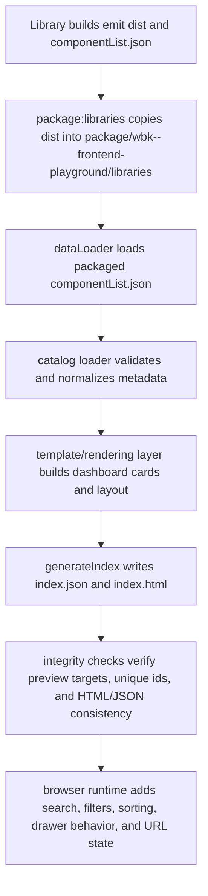

# Dashboard Refactor And Rebuild Plan (Vanilla JS)

## Scope

- Target: `dashboard/` static generator and runtime dashboard behavior.
- Constraint: vanilla JavaScript only, no frameworks.
- Goal: improve architecture, maintainability, reliability, and UX while keeping existing feature behavior equivalent.

## Current State Summary

- Dashboard build is a Node-based static generator (`dashboard/index.js` -> `core/generateIndex.js`).
- Data input contract is currently `componentList.json` per library, with fallback reads from `libraries/*/dist`.
- UI is generated from string templates and enhanced by embedded browser script.
- Main risks today: hidden data contract drift, weak validation, mixed rendering/behavior concerns, and partial mobile/accessibility support.

## Refactor Principles

- Single responsibility by module: data, validation, rendering, UI behavior should be separated.
- Fail-fast contracts: invalid/missing data should fail builds with explicit diagnostics.
- Deterministic generation: same input should produce same output and logs.
- Progressive enhancement: runtime JS adds behavior on top of semantic HTML.
- Keep feature parity first, improve UX in controlled increments.

## Phased Plan

### Phase 0: Contract Hardening And Build Safety

- Add schema-like validation for component metadata shape at dashboard build-time.
- Normalize optional fields to avoid runtime template crashes.
- Fail build with non-zero exit code on invalid metadata or empty catalog.
- Make fallback usage explicit in logs so packaging drift is visible.
- Keep output paths and generated features unchanged.

Deliverables:

- Validation module in `dashboard/core`.
- Updated `dataLoader` pipeline with validation/normalization.
- Updated `generateIndex` to fail CI correctly.

### Phase 1: Data Layer Separation

- Create a dedicated catalog layer (`loader`, `validator`, `normalizer`, `repository`).
- Isolate file-system concerns from transformation concerns.
- Introduce source strategy (`packaged`, optional fallback) as explicit policy.
- Add lightweight tests for transform/validation functions.

Phase 1 progress (completed):

- [x] Added catalog modules in `dashboard/core/catalog/` (`loader`, `validator`, `normalizer`, `repository`, `sourceStrategies`).
- [x] Rewired `core/dataLoader.js` to use the catalog loader instead of direct utils coupling.
- [x] Added lightweight Node tests at `dashboard/core/catalog/catalog.test.js`.
- [x] Added broader repository/loader tests and root scripts (`test:dashboard:catalog`, `test:dashboard`).

### Phase 2: Rendering Architecture Cleanup

- Replace deep nested template strings with focused renderer functions and reusable primitives.
- Add escaping utilities for HTML/attribute-safe interpolation.
- Centralize URL generation and ID generation utilities.
- Keep generated DOM structure backward compatible for runtime behavior.

Phase 2 progress (completed):

- [x] Added rendering helpers in `dashboard/core/rendering/` for HTML escaping and URL/ID composition.
- [x] Refactored `templates/componentTemplate.js` to use helper primitives and escaped interpolation.
- [x] Added rendering utility tests at `dashboard/core/rendering/rendering.test.js` and wired `test:dashboard:rendering`.
- [x] Decomposed `library`, `group`, and `category` templates into cleaner pure composition paths.
- [x] Added template integration tests at `dashboard/core/templates/templates.test.js` and wired `test:dashboard:templates`.
- [x] Decomposed `htmlPartials` into builder functions and added inline script sanitization strategy + tests.

### Phase 3: Runtime Behavior Refactor (Vanilla JS)

- Replace inline event handlers with delegated listeners.
- Introduce a small state store for query/category/library/sort state.
- Compose filters (search + category + library + sort) deterministically.
- Remove dead paths (unused modal APIs) after parity verification.

Phase 3 progress (completed):

- [x] Replaced inline sidebar handlers with delegated click events.
- [x] Added runtime state store for composed `query + category` filtering.
- [x] Added deterministic `applyFilters()` flow and centralized active-link state updates.
- [x] Extended runtime state with library + sort controls and reset flow.
- [x] Removed dead runtime modal API path after compatibility check.

Phase 3.1: Bugfixing

- [x] Preview link does not work
    - ACTUAL: link goes to `dev-days-matrix-library/library/modules/audio-player/custom-audio-player`
    - EXPECTED: link goes to `wbk--frontend-playground/libraries/dev-days-matrix-library/library/modules/audio-player/custom-audio-player`

### Phase 4: UX/UI And Accessibility Upgrades

- Mobile filter drawer with keyboard-safe open/close behavior.
- Dynamic category/library filter chips from generated data.
- Empty state and result counts.
- Accessibility baseline: focus management, ARIA labels, reduced motion support.
- Performance: lazy images, avoid duplicated modal markup, minimize inline script weight.

Phase 4 progress (in progress):

- [x] Added mobile sidebar toggle/close controls with keyboard-safe `Escape` handling.
- [x] Added active-filter chips and live results summary.
- [x] Added empty state message when no cards match filters.
- [x] Added reduced-motion CSS behavior and lazy image loading (`loading="lazy"`, `decoding="async"`).
- [x] Added dynamic category filter rendering from card data.
- [x] Added URL-state persistence for query/category/library/sort.
- [x] Improved drawer focus behavior by moving focus into filters on open and back to trigger on close.

Phase 4.1: Bugfixing

- [x] On Desktop the `top: 56px` css value make ssidebar to cover the header
- [x] On Mobile the Filters button does not show the sidebar
      Phase 4.2: Bugfixing
- [x] Now on Desktop it takes full width of the screen instead of just sidebar width

### Phase 5: Quality Gates And Tooling

- Add build checks for broken preview links and duplicate slugs/IDs.
- Add smoke checks for generated `index.html` and `index.json` consistency.
- Add lint rules and CI checks scoped to dashboard modules.
- Document dashboard architecture in `_docs/architecture/readme.md` with diagrams.

Phase 5 progress (completed):

- [x] Added generated-artifact integrity checks for broken preview targets, duplicate slugs, duplicate HTML ids, and core HTML/JSON consistency.
- [x] Wired dashboard integrity validation into `build:dashboard` and added dedicated quality tests in `dashboard/quality/`.
- [x] Added dashboard-scoped lint rules plus `lint:dashboard`, `verify:dashboard`, and `check:dashboard` scripts.
- [x] Added a GitHub Actions dashboard quality job and documented the dashboard architecture in `_docs/architecture/readme.md`.

## Feature Parity Requirements (Must Hold)

- Preserve generation of `package/wbk--frontend-playground/libraries/index.html`.
- Preserve generation of `package/wbk--frontend-playground/libraries/index.json`.
- Preserve hide flags (`component.hide`, `variation.hide`).
- Preserve card creation for all visible component variations.
- Preserve preview links and image gallery behavior.
- Preserve search and category filtering behavior (then improve composition).

## UX/UI Backlog (Post-Parity)

- Add library-level filter and sorting options (A-Z, recently updated if data exists).
- Add active-filter chips with one-click clear.
- Add persistent filter state in URL query params.
- Add skeleton loading state for large catalogs.
- Add visual regression snapshots for generated dashboard page.

## Phase 0 Implementation Checklist

- [x] Implement validator + normalizer module.
- [x] Wire validator into `core/dataLoader.js`.
- [x] Update `utils/processDirectories` fallback logs.
- [x] Ensure `core/generateIndex.js` exits with non-zero on failure.
- [x] Run `yarn build:dashboard` and verify output integrity.

---

# Dashboard Architecture

## Purpose

- The dashboard is a static catalog generator for packaged component libraries.
- It reads normalized component metadata, renders a single dashboard HTML page, and emits a machine-readable JSON snapshot for downstream checks.
- Runtime behavior stays vanilla JavaScript and progressively enhances generated semantic HTML.

## Build Flow

## Module Boundaries

### Catalog layer

- `dashboard/core/catalog/sourceStrategies.js`: packaged and fallback metadata reads.
- `dashboard/core/catalog/repository.js`: source policy selection.
- `dashboard/core/catalog/validator.js`: structural contract checks.
- `dashboard/core/catalog/normalizer.js`: defaults, warnings, hidden-entry cleanup.
- `dashboard/core/catalog/loader.js`: orchestration from raw metadata to grouped catalog.

### Rendering layer

- `dashboard/core/rendering/html.js`: HTML, attribute, and inline-script escaping.
- `dashboard/core/rendering/paths.js`: preview URLs, image URLs, and deterministic card ids.
- `dashboard/core/templates/*`: category, group, library, sidebar, and component renderers.
- `dashboard/core/htmlBuilder.js` and `dashboard/core/htmlPartials.js`: page shell assembly and shared CSS/navbar/footer builders.

### Runtime layer

- `dashboard/scripts/index.js`: delegated UI behavior for search, category/library filters, sorting, URL sync, result summaries, empty state, and the mobile filter drawer.

### Quality layer

- `dashboard/quality/integrity.js`: generated artifact smoke checks.
- `dashboard/quality/lintDashboard.js`: dashboard-specific lint rules that guard against inline handlers and unsafe URL patterns.

## Generated Artifacts

- `package/wbk--frontend-playground/libraries/index.json`: grouped catalog snapshot used as the dashboard contract.
- `package/wbk--frontend-playground/libraries/index.html`: generated dashboard page.
- `package/wbk--frontend-playground/libraries/<library>/.../*.html`: component preview targets referenced by dashboard cards.

## Quality Gates

- `yarn test:dashboard`: unit coverage for catalog, rendering, templates, core document builders, and integrity helpers.
- `yarn lint:dashboard`: scoped dashboard lint pass over production `dashboard/core` and `dashboard/scripts` modules.
- `yarn build:dashboard`: generates the dashboard and fails if integrity checks detect broken preview targets, duplicate slugs/ids, or HTML/JSON drift.
- `yarn check:dashboard`: project-facing Phase 5 gate that runs tests, lint, and the build-integrity path.

## Design Constraints

- Vanilla JavaScript only for runtime behavior.
- Feature parity first: hide flags, preview links, gallery modals, and filtering behavior must remain intact.
- Deterministic generation: the same packaged metadata should produce the same HTML, JSON, and quality outcomes.
