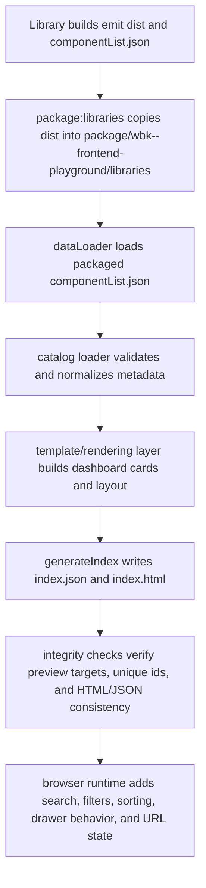

# Dashboard Architecture

## Purpose
- The dashboard is a static catalog generator for packaged component libraries.
- It reads normalized component metadata, renders a single dashboard HTML page, and emits a machine-readable JSON snapshot for downstream checks.
- Runtime behavior stays vanilla JavaScript and progressively enhances generated semantic HTML.

## Build Flow

## Module Boundaries

### Catalog layer
- `dashboard/core/catalog/sourceStrategies.js`: packaged and fallback metadata reads.
- `dashboard/core/catalog/repository.js`: source policy selection.
- `dashboard/core/catalog/validator.js`: structural contract checks.
- `dashboard/core/catalog/normalizer.js`: defaults, warnings, hidden-entry cleanup.
- `dashboard/core/catalog/loader.js`: orchestration from raw metadata to grouped catalog.

### Rendering layer
- `dashboard/core/rendering/html.js`: HTML, attribute, and inline-script escaping.
- `dashboard/core/rendering/paths.js`: preview URLs, image URLs, and deterministic card ids.
- `dashboard/core/templates/*`: category, group, library, sidebar, and component renderers.
- `dashboard/core/htmlBuilder.js` and `dashboard/core/htmlPartials.js`: page shell assembly and shared CSS/navbar/footer builders.

### Runtime layer
- `dashboard/scripts/index.js`: delegated UI behavior for search, category/library filters, sorting, URL sync, result summaries, empty state, and the mobile filter drawer.

### Quality layer
- `dashboard/quality/integrity.js`: generated artifact smoke checks.
- `dashboard/quality/lintDashboard.js`: dashboard-specific lint rules that guard against inline handlers and unsafe URL patterns.

## Generated Artifacts
- `package/wbk--frontend-playground/libraries/index.json`: grouped catalog snapshot used as the dashboard contract.
- `package/wbk--frontend-playground/libraries/index.html`: generated dashboard page.
- `package/wbk--frontend-playground/libraries/<library>/.../*.html`: component preview targets referenced by dashboard cards.

## Quality Gates
- `yarn test:dashboard`: unit coverage for catalog, rendering, templates, core document builders, and integrity helpers.
- `yarn lint:dashboard`: scoped dashboard lint pass over production `dashboard/core` and `dashboard/scripts` modules.
- `yarn build:dashboard`: generates the dashboard and fails if integrity checks detect broken preview targets, duplicate slugs/ids, or HTML/JSON drift.
- `yarn check:dashboard`: project-facing Phase 5 gate that runs tests, lint, and the build-integrity path.

## Design Constraints
- Vanilla JavaScript only for runtime behavior.
- Feature parity first: hide flags, preview links, gallery modals, and filtering behavior must remain intact.
- Deterministic generation: the same packaged metadata should produce the same HTML, JSON, and quality outcomes.
