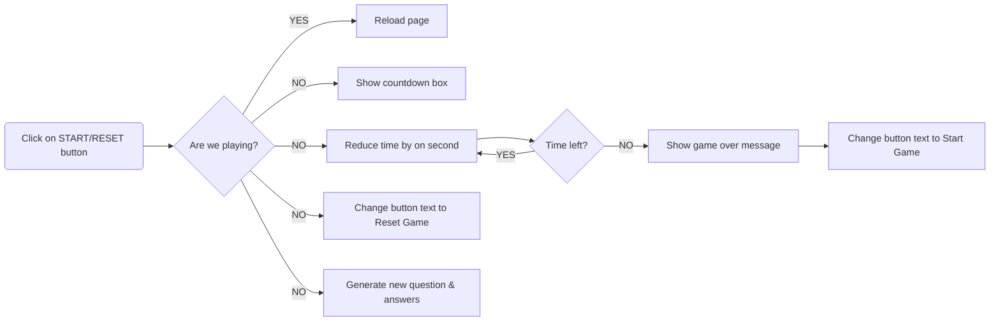

# Math Game Logic

```mermaid
graph LR
  start(Click on START/RESET button)
  play{Are we playing?}
  reload[Reload page]
    start --> play
    play --> |YES| reload
  show_countdown[Show countdown box]
  reduce_time[Reduce time by on second]
  change_button_text[Change button text to Reset Game]
  generate_new_question[Generate new question & answers]
    play --> |NO| show_countdown
    play --> |NO| reduce_time
    play --> |NO| change_button_text
    play --> |NO| generate_new_question
  time_left{Time left?}
    show_game_over[Show game over message]
    change_button_text_start[Change button text to Start Game]
    reduce_time --> time_left
    time_left --> |YES| reduce_time
    time_left --> |NO| show_game_over
    show_game_over --> change_button_text_start
```
